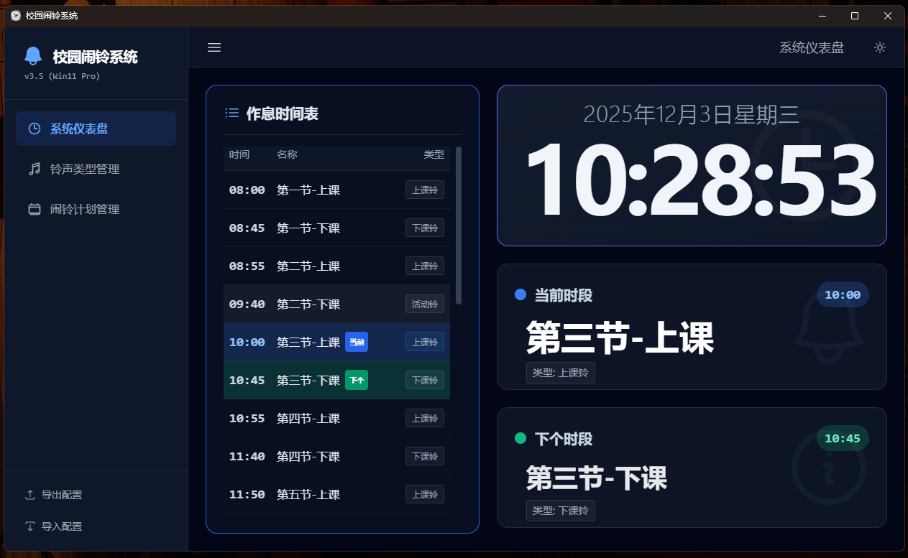

# 简介

学校闹钟系统，可用于日常学习。

# 使用方式：

## 1.在线预览

[点我](http://alarm.8008088.xyz/)

## 2.安装版

下载直接安装

## 3.便携版

下载解压后使用

## 4.本地运行

### 4.1.克隆项目到本地

   `git clone https://github.com/Juna3066/study-alarm-system.git`
   
### 4.2. 执行命令

注意：本项目使用node版本是`18.16.0`

```
# 安装pnpm 因为它更快更好
npm install -g pnpm
# 安装依赖
pnpm install
# 本地运行，浏览器预览
pnpm run dev
# 打包为exe
pnpm run dist:win
# 打包为便携版
pnpm run dist:portable
```
   
## 4.3.效果图




## 4.效果图对应的配置文件

1. [school_bell_config.json](./default/school_bell_config.json)

2. [通用铃](./default/alarm-mp3-1a/通用铃-传统.mp3)
