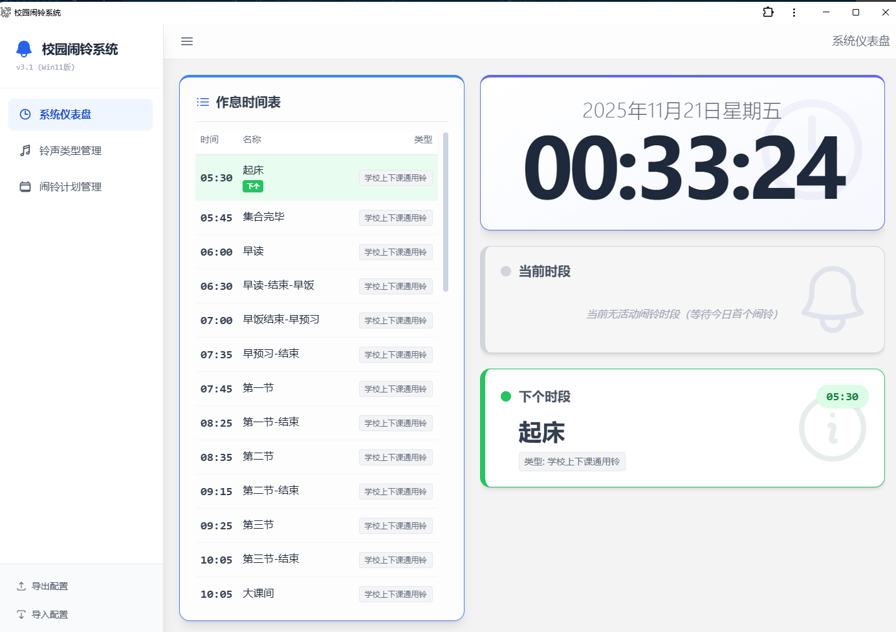
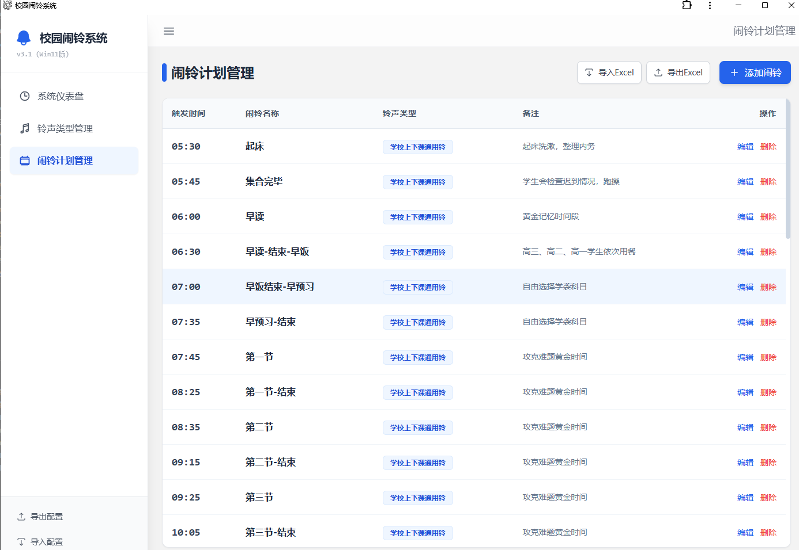
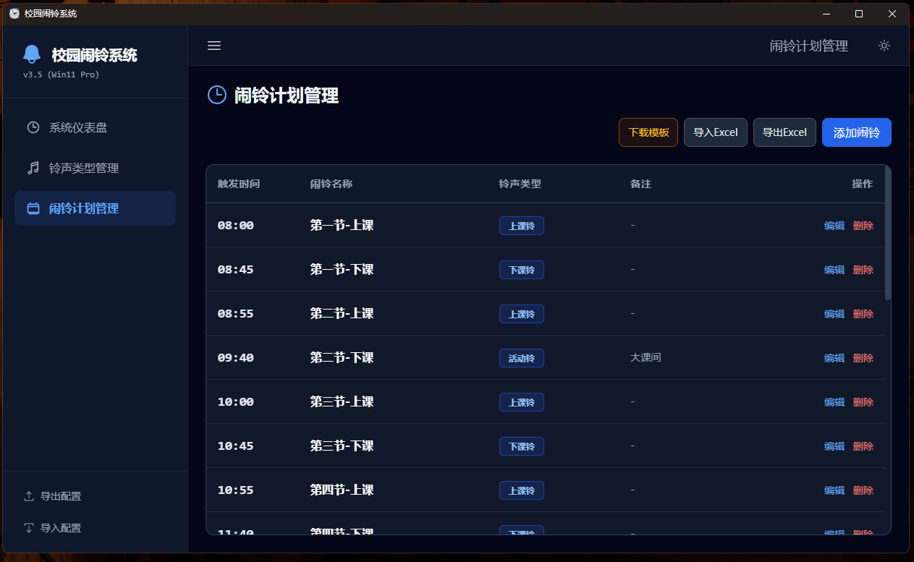

# Run and deploy your AI Studio app

This contains everything you need to run your app locally.

View your app in AI Studio: https://ai.studio/apps/drive/1YHf4ffTV6QcDDVufXiZ65sWt4xEuT_p-

## Run Locally

**Prerequisites:**  Node.js

## 1. Install dependencies:
   `npm install`
## 2. Run the app:
   `npm run dev`

## 在线预览

[点我](http://alarm.8008088.xyz/)

## 效果图

## 效果图对应的配置文件

1. [school_bell_config.json](./config-info/school_bell_config.json)

2. [闹铃计划.xlsx](./config-info/闹铃计划.xlsx)

3. [学校上下课通用铃声.mp3](./config-info/学校上下课通用铃声.mp3)